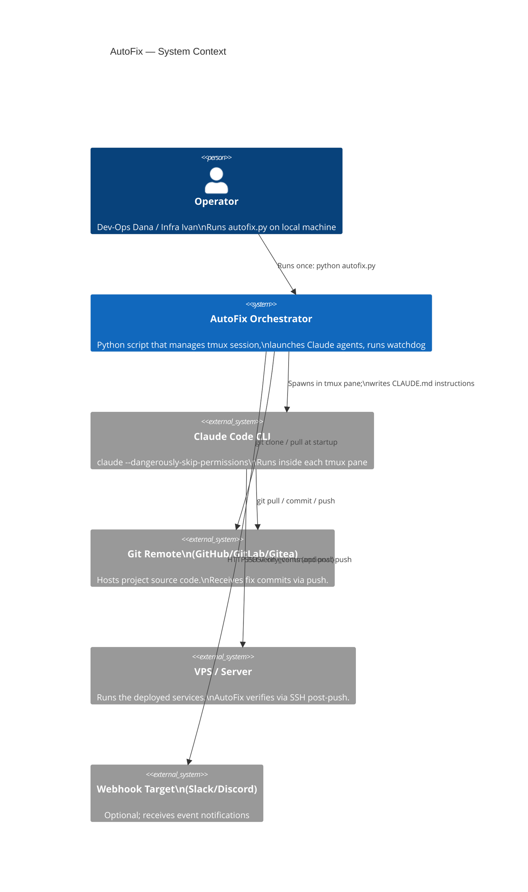
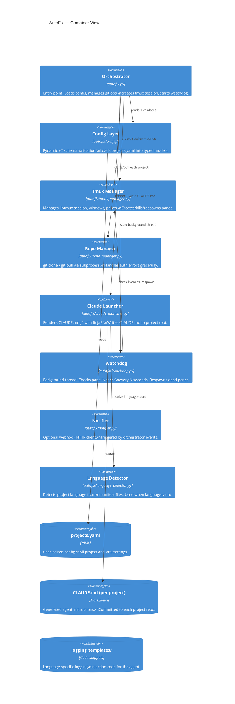
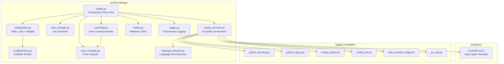
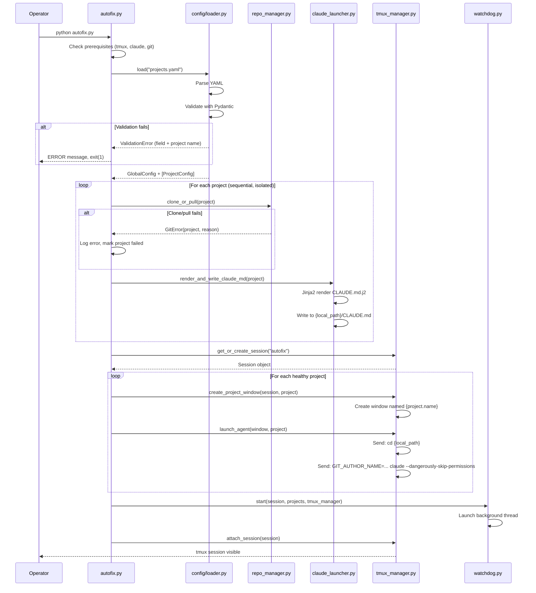
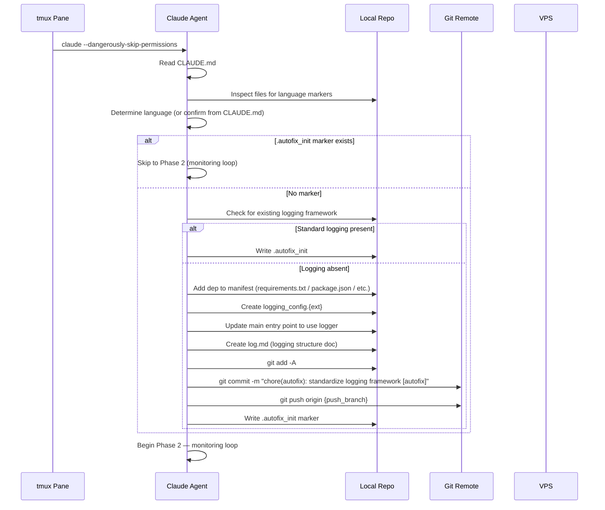
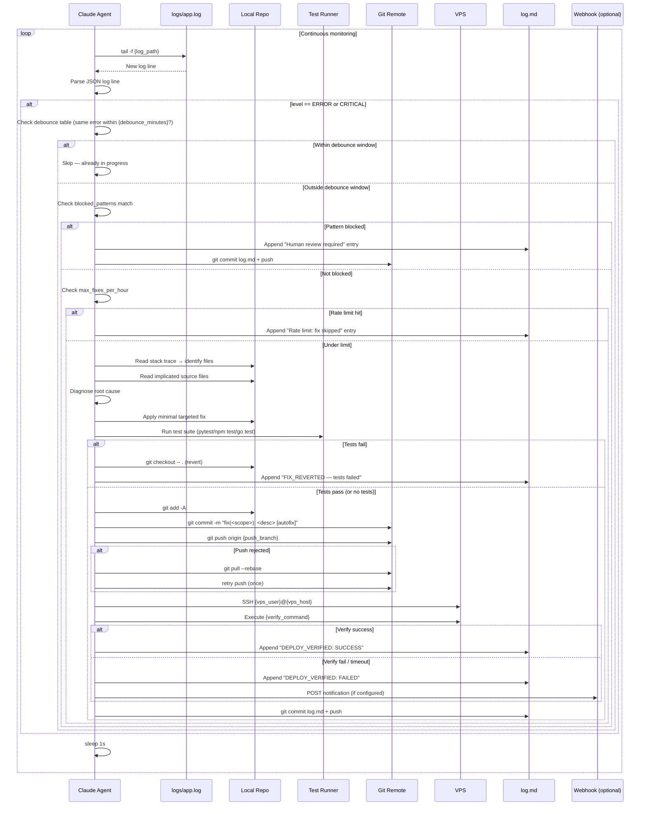
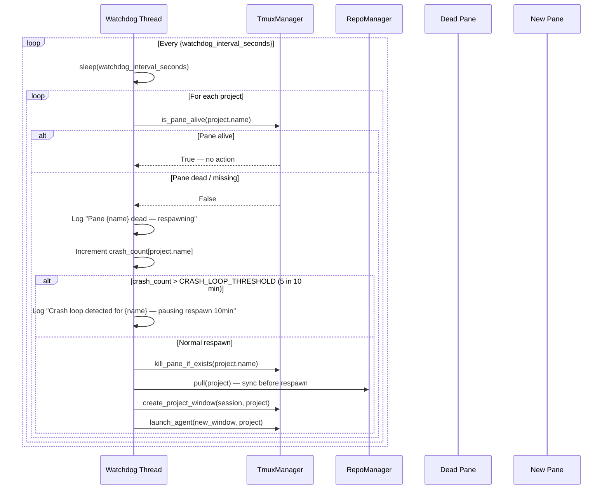

# Architecture: AutoFix — Autonomous Multi-Project Log Monitoring & Auto-Fix System

**Version:** 1.0  
**Status:** Final  
**Author:** Atlas (Architect)  
**Date:** 2025-01-01  
**PRD:** `docs/product/autofix/PRD.md`

---

## 1. Context (from PRD)

AutoFix is a **single-command, script-based autonomous monitoring and auto-fix system** that runs on any developer machine (macOS/Linux) without root access. It reads a `projects.yaml` config, clones/pulls each listed Git repository, opens one tmux pane per project, and launches a Claude Code CLI agent (`claude --dangerously-skip-permissions`) in each pane. Each agent:

1. Enforces standardized structured JSON logging in the project (injecting a framework if absent).
2. Enters a continuous loop: tail logs → detect ERROR/CRITICAL → diagnose → fix → run tests → commit → push → SSH-verify on VPS → loop.
3. Maintains a `log.md` audit trail in the project root.

A watchdog process running in the orchestrator detects dead panes and respawns them automatically.

**Key constraints (non-negotiable per PRD Section 15):**
- No UI; tmux is the interface
- `claude --dangerously-skip-permissions` is the only agent mechanism
- SSH key auth only; no passwords
- VPS-only deployment (no cloud SDKs)
- Python 3.9+ orchestrator; YAML config; ≤10 projects in v1

---

## 2. Constraints & Quality Attributes

| Attribute | Target | Source |
|---|---|---|
| **Startup time** | ≤ 60s for ≤10 projects | NFR-6.1 |
| **Log tail latency** | ≤ 5s line-written → agent reads | NFR-6.2 |
| **Watchdog recovery** | ≤ 2× interval (max 120s) | NFR-2.2 |
| **CPU on idle** | < 1% for watchdog loop | NFR-6.3 |
| **False-fix rate** | < 5% | Success metrics |
| **Portability** | macOS 12+, Ubuntu 20.04+, no root | NFR-1 |
| **Auditability** | Every fix traceable to `[autofix]` commit + `log.md` entry | NFR-4 |
| **Security** | No plaintext credentials in any committed file | NFR-3 |
| **Isolation** | One project failure must not affect others | NFR-2.1 |
| **Max projects (v1)** | 10 | Approved defaults |

---

## 3. High-Level Design

### 3.1 System Context



### 3.2 Container Diagram



---

## 4. Components

### 4.1 Component Diagram



### 4.2 Component Responsibilities

| Component | File | Responsibility |
|---|---|---|
| **Orchestrator** | `autofix.py` | CLI entry point; wires all components; startup sequence; attaches to tmux |
| **Config Loader** | `autofix/config/loader.py` | Reads `projects.yaml`; catches YAML parse errors; calls validator |
| **Config Schema** | `autofix/config/schema.py` | Pydantic v2 models; field-level validation; defaults; uniqueness checks |
| **Repo Manager** | `autofix/repo_manager.py` | `git clone` / `git pull` via subprocess; SSH-key-aware env; per-project error isolation |
| **Claude Launcher** | `autofix/claude_launcher.py` | Jinja2 template rendering; writes `CLAUDE.md` to `local_path`; embeds all project-specific values |
| **Tmux Manager** | `autofix/tmux_manager.py` | libtmux wrapper; session/pane lifecycle; key-sending; liveness checks |
| **Watchdog** | `autofix/watchdog.py` | `threading.Thread`; polls pane liveness; calls respawn on dead panes; crash-loop detection |
| **Notifier** | `autofix/notifier.py` | HTTP POST to webhook URLs; event payload serialization; error-tolerant (never blocks main loop) |
| **Language Detector** | `autofix/language_detector.py` | Inspects manifest files to resolve `language: auto`; returns canonical language string |
| **Logger** | `autofix/logger.py` | Orchestrator-level structured logging to stdout + `autofix.log`; ISO 8601 timestamps |
| **CLAUDE.md.j2** | `templates/CLAUDE.md.j2` | Jinja2 template; full agent instruction set; no secrets embedded |
| **Logging Templates** | `logging_templates/` | Static code snippets the Claude agent references when injecting logging frameworks |

---

## 5. Key Flows

### 5.1 Cold Start (First Run)



### 5.2 Claude Agent Startup (Per Pane — Phase 1)



### 5.3 Auto-Fix Cycle (Error Detected → Commit → Verify)



> **Note — Log Stream Method:**
> The method the Claude agent uses to consume log lines depends on `vps.enabled`:
>
> | `vps.enabled` | Log stream method |
> |---|---|
> | `true` | `ssh -i {ssh_key_path} {vps_user}@{vps_host} "{vps_log_stream_command}"` — streams Docker logs in real-time from the VPS. The `vps_log_stream_command` defaults to `docker logs -f {docker_container_name}` and can be overridden per project. On SSH disconnect the agent waits 10 s and reconnects. |
> | `false` | `tail -F {local_path}/{log_path}` — tails a local log file. Used for projects deployed via CI/CD pipeline without a VPS. |
>
> This conditional behaviour is rendered into `CLAUDE.md` via the `` Jinja2 block in `templates/CLAUDE.md.j2` (Sections 5.2 and 6).

### 5.4 Watchdog Recovery



### 5.5 SSH Verification Flow (Detail)

```mermaid
sequenceDiagram
    participant Agent as Claude Agent
    participant SSH as SSH Client (subprocess)
    participant VPS as VPS Host

    Agent->>Agent: Resolve ssh_key_path (~/ expansion)
    Agent->>Agent: Check ssh_key_path exists on filesystem
    alt Key missing
        Agent->>Agent: Log "SSH key not found: {path}"
        Agent->>Agent: Skip verification; continue loop
    else Key found
        Agent->>SSH: ssh -i {ssh_key_path} -o StrictHostKeyChecking=no\n  -o ConnectTimeout={timeout}\n  {vps_user}@{vps_host}\n  '{verify_command}'
        SSH->>VPS: Connect + execute
        alt Exit code 0
            alt verify_output_contains set
                SSH-->>Agent: stdout
                Agent->>Agent: Check substring match
                alt Match found
                    Agent->>Agent: DEPLOY_VERIFIED: SUCCESS
                else No match
                    Agent->>Agent: DEPLOY_VERIFIED: FAILED (output mismatch)
                end
            else No substring check
                Agent->>Agent: DEPLOY_VERIFIED: SUCCESS
            end
        else Non-zero exit / timeout
            SSH-->>Agent: error
            Agent->>Agent: DEPLOY_VERIFIED: FAILED
        end
    end
```

---

## 6. Data Model

See [`data-models.md`](./data-models.md) for the complete annotated schema.

**Summary of data objects:**

| Object | Location | Format | Owner |
|---|---|---|---|
| `GlobalConfig` | Pydantic model | In-memory | Orchestrator |
| `ProjectConfig` | Pydantic model | In-memory | Orchestrator |
| `projects.yaml` | File on disk | YAML | Operator |
| `CLAUDE.md` | `{local_path}/CLAUDE.md` | Markdown | Orchestrator (writes), Agent (reads + commits) |
| `log.md` | `{local_path}/log.md` | Markdown table | Agent (writes + commits) |
| `.autofix_init` | `{local_path}/.autofix_init` | Empty marker | Agent |
| `autofix.log` | `./autofix.log` | JSON lines | Orchestrator |
| Logging config | `{local_path}/logging_config.{ext}` | Language-specific | Agent (injects) |

---

## 7. Interfaces / APIs

### 7.1 Orchestrator CLI Interface

```
# ILLUSTRATIVE — not production code
python autofix.py [OPTIONS]

Options:
  --config PATH      Path to projects.yaml  [default: ./projects.yaml]
  --dry-run          Validate config + show what would happen; no side effects
  --attach / --no-attach
                     Attach terminal to tmux session after startup [default: --attach]
  --log-level TEXT   Orchestrator log level: DEBUG|INFO|WARNING|ERROR [default: INFO]
```

**Exit codes:**
- `0` — Success; session running
- `1` — Config validation failure
- `2` — Prerequisite missing (tmux/claude/git not found)
- `3` — All projects failed (git errors on every project)

### 7.2 `config/schema.py` — Pydantic Model Interfaces

```python
# ILLUSTRATIVE PSEUDOCODE — not production code

class VPSConfig(BaseModel):
    host: str
    user: str
    ssh_key_path: str            # Resolved, existence-checked at validation time
    verify_command: str
    verify_output_contains: Optional[str] = None
    verify_timeout_seconds: int = 30
    enabled: bool = True         # Set False for CI/CD-deployed projects

class GitConfig(BaseModel):
    push_branch: Optional[str] = None  # Defaults to project.branch
    pull_before_fix: bool = True
    commit_sign: bool = False

class MonitoringConfig(BaseModel):
    error_debounce_minutes: int = 5
    max_fixes_per_hour: int = 3          # Validated: 1 ≤ x ≤ 20
    blocked_patterns: list[str] = []

class NotificationsConfig(BaseModel):
    webhook_url: Optional[str] = None
    on_events: list[str] = []

class ProjectConfig(BaseModel):
    name: str                           # Unique; used as tmux window name
    repo_url: str
    local_path: str                     # Must be absolute path
    branch: str = "main"
    language: str = "auto"              # python|nodejs|ruby|go|auto
    log_path: str = "logs/app.log"
    vps: VPSConfig
    git: GitConfig = GitConfig()
    monitoring: MonitoringConfig = MonitoringConfig()
    notifications: Optional[NotificationsConfig] = None

class GlobalConfig(BaseModel):
    schema_version: str                 # Required; warn on unknown versions
    global_settings: GlobalSettings = GlobalSettings()
    projects: list[ProjectConfig]       # Max 10 in v1; names must be unique
```

### 7.3 `TmuxManager` Interface

```python
# ILLUSTRATIVE PSEUDOCODE

class TmuxManager:
    def __init__(self, session_name: str, claude_command: str): ...

    def get_or_create_session(self) -> libtmux.Session: ...
    # Returns existing session by name, or creates new one.

    def create_project_window(self, session: libtmux.Session, project: ProjectConfig) -> libtmux.Window: ...
    # Creates a window named project.name with one pane.

    def launch_agent(self, window: libtmux.Window, project: ProjectConfig, git_env: dict) -> None: ...
    # Sends: "cd {local_path} && GIT_AUTHOR_NAME=... GIT_AUTHOR_EMAIL=... claude --dangerously-skip-permissions"

    def is_pane_alive(self, session: libtmux.Session, project_name: str) -> bool: ...
    # Returns True if window named project_name exists and pane is not dead.

    def kill_window_if_exists(self, session: libtmux.Session, project_name: str) -> None: ...

    def attach_session(self, session: libtmux.Session) -> None: ...
    # Calls: tmux attach-session -t {session_name}
```

### 7.4 `RepoManager` Interface

```python
# ILLUSTRATIVE PSEUDOCODE

class RepoManager:
    def __init__(self, git_author_name: str, git_author_email: str): ...

    def clone_or_pull(self, project: ProjectConfig) -> RepoResult: ...
    # Returns: RepoResult(success=bool, action="clone"|"pull", error=Optional[str])

    def clone(self, project: ProjectConfig) -> RepoResult: ...
    def pull(self, project: ProjectConfig) -> RepoResult: ...

    def _run_git(self, args: list[str], cwd: str, timeout: int = 120) -> subprocess.CompletedProcess: ...
    # Sets GIT_SSH_COMMAND if ssh_key_path specified; no credential prompts.

@dataclass
class RepoResult:
    success: bool
    action: str        # "clone" | "pull" | "skip"
    project_name: str
    error: Optional[str] = None
```

### 7.5 `ClaudeLauncher` Interface

```python
# ILLUSTRATIVE PSEUDOCODE

class ClaudeLauncher:
    def __init__(self, template_dir: str = "templates/"): ...

    def render_claude_md(self, project: ProjectConfig, global_cfg: GlobalSettings) -> str: ...
    # Renders CLAUDE.md.j2 with all project-specific values.

    def write_claude_md(self, project: ProjectConfig, content: str) -> Path: ...
    # Writes to {project.local_path}/CLAUDE.md; returns path.

    def render_and_write(self, project: ProjectConfig, global_cfg: GlobalSettings) -> Path: ...
    # Convenience: render + write.
```

### 7.6 `Watchdog` Interface

```python
# ILLUSTRATIVE PSEUDOCODE

class Watchdog:
    CRASH_LOOP_WINDOW_SECONDS = 600    # 10 minutes
    CRASH_LOOP_THRESHOLD = 5           # >5 restarts in window = crash loop

    def __init__(
        self,
        session: libtmux.Session,
        projects: list[ProjectConfig],
        tmux_manager: TmuxManager,
        repo_manager: RepoManager,
        interval_seconds: int = 60,
        global_cfg: GlobalSettings = None,
    ): ...

    def start(self) -> threading.Thread: ...
    # Launches daemon thread; returns handle.

    def stop(self) -> None: ...
    # Signals the loop to stop.

    def _check_loop(self) -> None: ...
    # Main loop: sleep → check each project → respawn if needed.

    def _respawn(self, project: ProjectConfig) -> None: ...
    # pull → create_window → launch_agent
```

### 7.7 `Notifier` Interface

```python
# ILLUSTRATIVE PSEUDOCODE

class Notifier:
    def notify(
        self,
        project: ProjectConfig,
        event: str,          # "fix_applied" | "fix_failed" | "verification_failed"
        payload: dict,       # {"error_summary": ..., "commit_sha": ..., "status": ...}
    ) -> bool: ...
    # Returns True on success; logs warning on failure; never raises.
```

---

## 8. Cross-Cutting Concerns

### 8.1 Authentication & Security

| Concern | Decision |
|---|---|
| Git remote auth | SSH keys on host machine; `GIT_SSH_COMMAND="ssh -i {key} -o StrictHostKeyChecking=no"` env var injected into git subprocess |
| VPS SSH auth | Key-based only; `ssh -i {ssh_key_path} -o BatchMode=yes -o StrictHostKeyChecking=no` |
| Credential storage | Zero credentials in code, YAML, or committed files. Key paths only. |
| CLAUDE.md security | Template renders key _paths_ (not contents); validated that no secrets are interpolated |
| blocked_patterns | Default patterns prevent auto-fix on CVE/security/injection/migration errors |
| Git commit identity | `GIT_AUTHOR_NAME` + `GIT_AUTHOR_EMAIL` env vars; all agent commits tagged `[autofix]` |

### 8.2 Observability — Orchestrator Level

**Orchestrator log** (`autofix.log` + stdout): JSON lines, one per event.

```json
// ILLUSTRATIVE LOG LINE FORMAT
{
  "ts": "2025-01-01T10:00:00.000Z",
  "level": "INFO",
  "component": "orchestrator",
  "event": "project_started",
  "project": "my-api",
  "action": "clone",
  "detail": "Cloned git@github.com:user/my-api.git to /home/user/projects/my-api"
}
```

**Event types logged at orchestrator level:**
- `startup_begin`, `config_loaded`, `config_invalid`
- `prereq_check_ok`, `prereq_missing`
- `project_clone_ok`, `project_clone_fail`, `project_pull_ok`, `project_pull_fail`
- `claude_md_written`
- `session_created`, `session_exists`, `pane_created`, `agent_launched`
- `watchdog_started`, `pane_dead_detected`, `pane_respawned`, `crash_loop_detected`
- `notification_sent`, `notification_failed`

### 8.3 Error Handling Strategy

| Error Type | Scope | Handling |
|---|---|---|
| `projects.yaml` missing | Global | Print specific message, `exit(1)` |
| YAML parse error | Global | Print error + line number, `exit(1)` |
| Schema validation error | Global | Print per-field errors, `exit(1)` |
| Prerequisite missing | Global | Print install instructions, `exit(2)` |
| `git clone` fails | Per-project | Log error; skip pane creation; other projects unaffected |
| `git pull` fails | Per-project | Log error; proceed with stale local code; pane still starts |
| CLAUDE.md write fails | Per-project | Log error; skip pane creation for that project |
| Pane launch fails | Per-project | Log error; watchdog will retry after interval |
| Pane dead | Per-project | Watchdog detects and respawns |
| Crash loop detected | Per-project | Suspend respawn for 10 minutes; log warning |
| Webhook fails | Non-blocking | Log warning; never propagates to main loop |

### 8.4 Logging Templates — Injection Strategy

The Claude agent reads the project's `CLAUDE.md` which embeds or references the appropriate logging template. The templates in `logging_templates/` are **static reference files** the agent uses as implementation guides. The agent performs actual file injection; AutoFix does not inject code itself.

**Template availability matrix:**

| Language | Primary Framework | Dep Declaration | Config File | Entry Point Patch |
|---|---|---|---|---|
| Python | `structlog` | `requirements.txt` | `logging_config.py` | `import logging_config` in `main.py` / `app.py` |
| Python (alt) | `loguru` | `requirements.txt` | `logging_config.py` | `from loguru import logger` in entry point |
| Node.js | `winston` | `package.json` | `logger.js` | `const logger = require('./logger')` |
| Node.js (alt) | `pino` | `package.json` | `logger.js` | `const logger = require('./logger')` |
| Ruby | `semantic_logger` | `Gemfile` | `config/logging.rb` | `require_relative 'config/logging'` |
| Go | `zap` | `go.mod` | `internal/logger/logger.go` | `logger.Init()` in `main.go` |

**Canonical JSON log schema** (all frameworks configured to produce this):

```json
{
  "timestamp": "2025-01-01T12:00:00.000Z",
  "level": "INFO",
  "logger": "myapp.module.submodule",
  "message": "Human-readable message",
  "context": { "request_id": "abc-123" },
  "error": {
    "type": "ValueError",
    "message": "invalid literal for int()",
    "stack": "Traceback..."
  }
}
```

### 8.5 Language Detection Logic

`language_detector.py` uses priority-ordered manifest inspection:

```
# ILLUSTRATIVE LOGIC (not production code)
1. If go.mod exists → "go"
2. If Gemfile exists → "ruby"
3. If package.json exists → "nodejs"
4. If requirements.txt OR pyproject.toml OR Pipfile exists → "python"
5. Else → "unknown"  (agent will attempt heuristic detection)
```

### 8.6 CLAUDE.md Template Structure

The `templates/CLAUDE.md.j2` template is organized into the following sections. All `{{ }}` values are Jinja2 variables injected from `ProjectConfig`.

```
# AutoFix Agent Instructions — {{ project_name }}

## Section 1 — Identity & Constraints
[Autonomous mode declaration; no human interaction; no files outside project root;
 push only to {{ push_branch }}; all commits must contain [autofix]]

## Section 2 — Project Context
[project_name, language, local_path, log_path, branch, push_branch,
 vps_host, vps_user, ssh_key_path, verify_command, verify_output_contains,
 debounce_minutes, max_fixes_per_hour, blocked_patterns (as list)]

## Section 3 — Phase 1: Logging Standardization (Run Once)
[Check .autofix_init; if absent: detect/inject logging; create log.md;
 commit+push; write .autofix_init]

## Section 4 — Logging Framework Reference
[Embedded content or path reference to appropriate logging_template file]

## Section 5 — Phase 2: Continuous Monitoring Loop
[Full pseudocode loop: tail → detect → debounce → check blocked → diagnose →
 fix → test → commit → push → ssh-verify → log → sleep 1s]

## Section 6 — log.md Format
[Exact markdown table format for log.md entries]

## Section 7 — Error Escalation Rules
[blocked_patterns list; max retries = 3; push rebase-retry strategy]

## Section 8 — Safety Rules
[Never modify: .git/, CLAUDE.md itself; never push to branch other than {{ push_branch }};
 never embed credentials in commits]
```

---

## 9. Risks & Open Questions

### 9.1 Risks

| Risk | Likelihood | Impact | Mitigation |
|---|---|---|---|
| Claude agent exits due to context length limit | Medium | High | Watchdog respawns; CLAUDE.md kept concise (<2000 words) |
| Push conflict on shared repos (team + autofix) | Medium | Medium | `pull --rebase` strategy in CLAUDE.md; `blocked_patterns` for sensitive files |
| False-positive fixes break working code | Low | High | test-before-commit gate; `max_fixes_per_hour` rate limit; revert on test failure |
| VPS SSH key rotation breaks verification | Low | Medium | Clear error messages in log.md; pane shows error visually |
| Claude CLI behavioral changes (updates) | Medium | High | Pin claude CLI version in README; add version check at startup |
| tmux version incompatibilities | Low | Medium | Require tmux ≥ 3.0 (checked at startup); tested on macOS + Ubuntu |
| Agent enters infinite fix loop on unfixable error | Low | High | `max_fixes_per_hour` + "max retries = 3 per error hash" logic in CLAUDE.md |
| `log.md` commit spam on high-error projects | Medium | Low | Note in docs; future: batch commits as v2 option |

### 9.2 Resolved Open Questions (from PRD Section 16)

| OQ | Decision | Rationale |
|---|---|---|
| OQ-1 | `CLAUDE.md` committed to Git | Auditable; approved default; operators warned in README about potential merge conflicts |
| OQ-2 | VPS block optional via `vps.enabled: bool = True` | Keeps schema consistent; set `false` for CI/CD projects; SSH verify step skipped in CLAUDE.md |
| OQ-3 | `libtmux` for tmux management | Approved default; more robust than raw subprocess; Python-native objects |
| OQ-4 | `log.md` committed per-event | FR-10.4 mandates it; crash-safety > git log cleanliness; accepted trade-off |
| OQ-5 | `structlog` primary Python framework; `loguru` template included as alternative | Both approved; structlog more configurable for JSON output |
| OQ-6 | Max 10 projects enforced by schema validation | Practical tmux + Claude session limits; schema error if exceeded |

---

## 10. Phased Implementation Plan

See [`tech-plan.md`](./tech-plan.md) for the full phased implementation plan.

**Summary:**
- **Phase 1** — Project scaffold + config + repo manager + tmux manager + single-project end-to-end
- **Phase 2** — CLAUDE.md template + agent instruction design + all language logging templates
- **Phase 3** — Watchdog + deployment verification detail + notifications + dry-run mode

---

## 11. Architecture Decision Records

### ADR-001: CLAUDE.md Committed to Git

**Context:** The orchestrator writes `CLAUDE.md` to each project root before launching the Claude agent. The question is whether this file should be ephemeral (regenerated each run, not committed) or committed to Git.

**Options considered:**
1. Ephemeral — regenerated on each `autofix.py` run; never committed
2. Committed — agent commits `CLAUDE.md` as part of Phase 1 logging standardization

**Decision:** Committed (Option 2).

**Consequences:**
- ✅ Full audit trail of what instructions the agent operated under
- ✅ Humans can inspect/modify agent behavior by editing the committed file
- ✅ Aligns with FR-4.4 (explicit PRD requirement)
- ⚠️ Potential merge conflict if team members also modify it
- ⚠️ Regenerated by orchestrator on each run — if config changes, committed version diverges until agent re-commits
- **Mitigation:** Orchestrator always re-renders and writes `CLAUDE.md` before launching; any divergence is overwritten. Document this in README.

---

### ADR-002: libtmux vs Raw subprocess for tmux Management

**Context:** The orchestrator needs to create sessions, windows, and panes, check pane liveness, and send keystrokes.

**Options considered:**
1. Raw `subprocess` — `subprocess.run(["tmux", "new-session", ...])` for every operation
2. `libtmux` — Python library providing object-oriented tmux management

**Decision:** `libtmux` (Option 2). Confirmed approved default in PRD.

**Consequences:**
- ✅ Object-oriented API; session/window/pane as Python objects
- ✅ Reliable pane liveness detection via `pane.dead` property
- ✅ Key-sending via `pane.send_keys()` — no shell escaping issues
- ⚠️ Adds one dependency (`libtmux>=0.28`)
- ⚠️ `libtmux` API changes between versions — pin in `requirements.txt`

---

### ADR-003: structlog vs loguru for Python Logging Injection

**Context:** When a Python project lacks standard logging, the agent injects one of two possible frameworks.

**Options considered:**
1. `structlog` — highly configurable, explicit processor pipeline, JSON output
2. `loguru` — simpler API, zero-config, built-in JSON support

**Decision:** `structlog` is the primary recommended framework. `loguru` template is also provided as an alternative.

**Consequences:**
- ✅ `structlog` produces exactly the ECS-aligned JSON schema required (configurable)
- ✅ Explicit processor pipeline is auditable
- ⚠️ `structlog` requires more boilerplate config (~20 lines) vs `loguru` (~3 lines)
- **Alternative:** If agent detects `loguru` already present, it will standardize to the loguru template rather than replace it

---

### ADR-004: log.md Per-Event Commits vs Batched Commits

**Context:** FR-10.4 requires `log.md` to be committed and pushed after each update. This creates many small commits.

**Options considered:**
1. Per-event — commit + push `log.md` after every log entry
2. Batched — accumulate entries, commit every 5 minutes or N events

**Decision:** Per-event commits (Option 1) for v1.

**Consequences:**
- ✅ Zero data loss if agent crashes
- ✅ FR-10.4 compliance
- ✅ Real-time audit trail
- ⚠️ High commit frequency on active repos (potentially 10+ small commits/hour)
- ⚠️ Noisy git log
- **v2 consideration:** Add `log_commit_batch_minutes` config option (default 0 = per-event)

---

### ADR-005: Watchdog as Background Thread vs Separate Process

**Context:** The watchdog needs to periodically check pane liveness and respawn dead panes while the orchestrator's main thread waits on tmux attach.

**Options considered:**
1. `threading.Thread` (daemon) in the same Python process as the orchestrator
2. Separate subprocess (`subprocess.Popen`) that the orchestrator spawns

**Decision:** `threading.Thread` (Option 1).

**Consequences:**
- ✅ Simpler — no IPC needed; shares `TmuxManager` and `RepoManager` instances
- ✅ Daemon thread dies automatically when main process exits
- ⚠️ If orchestrator process is killed (SIGKILL), watchdog also dies
- **Mitigation:** Acceptable for v1 (single-operator tool); user can restart `autofix.py`. If orchestrator crashes, user gets clean state on re-run.

---

### ADR-006: VPS Verification — Optional via `vps.enabled` Flag

**Context:** Some projects deploy via CI/CD pipeline (GitHub Actions auto-deploys on push). For these, SSH verification is irrelevant. PRD OQ-2.

**Options considered:**
1. Require `vps` block; use empty `verify_command: ""` to disable
2. Add `vps.enabled: bool = True` flag; when `false`, skip entire SSH step
3. Make `vps` block entirely optional at schema level

**Decision:** Option 2 — `vps.enabled` flag, default `true`.

**Consequences:**
- ✅ Clean semantic — "VPS exists but verification is off" vs "no VPS configured"
- ✅ Keeps schema consistent across all projects
- ✅ CLAUDE.md template conditionally omits SSH step when `vps_enabled = false`
- ⚠️ Operators must remember to set `enabled: false` for CI/CD projects

---

## 12. Project Directory Structure

```
autofix/                              # Repository root
│
├── autofix.py                        # Entry point — run this
├── projects.yaml.example             # Example config (committed; rename to projects.yaml)
├── requirements.txt                  # Pinned Python deps
├── README.md                         # Setup + usage guide
├── .gitignore                        # Excludes: projects.yaml, autofix.log, __pycache__
│
├── autofix/                          # Python package
│   ├── __init__.py
│   ├── logger.py                     # Orchestrator structured logging (JSON lines)
│   ├── prereq_checker.py             # tmux/claude/git existence checks
│   │
│   ├── config/
│   │   ├── __init__.py
│   │   ├── schema.py                 # Pydantic v2 models: GlobalConfig, ProjectConfig, etc.
│   │   └── loader.py                 # YAML load + validate; returns GlobalConfig
│   │
│   ├── repo_manager.py               # git clone / git pull; RepoResult dataclass
│   ├── claude_launcher.py            # Jinja2 render + write CLAUDE.md
│   ├── tmux_manager.py               # libtmux session/window/pane lifecycle
│   ├── watchdog.py                   # threading.Thread pane monitor + respawn
│   ├── language_detector.py          # Manifest-based language auto-detection
│   └── notifier.py                   # Webhook HTTP client (requests)
│
├── templates/
│   └── CLAUDE.md.j2                  # Jinja2 agent instruction template
│
├── logging_templates/
│   ├── python_structlog.py           # structlog JSON config snippet
│   ├── python_loguru.py              # loguru JSON config snippet
│   ├── nodejs_winston.js             # winston JSON config snippet
│   ├── nodejs_pino.js                # pino JSON config snippet
│   ├── ruby_semantic_logger.rb       # semantic_logger config snippet
│   └── go_zap.go                     # uber-go/zap config snippet
│
├── tests/
│   ├── __init__.py
│   ├── test_config.py                # Config loading + validation tests
│   ├── test_repo_manager.py          # Git operation tests (mocked subprocess)
│   ├── test_claude_launcher.py       # Template rendering tests
│   ├── test_tmux_manager.py          # libtmux integration tests (mocked libtmux)
│   ├── test_watchdog.py              # Watchdog thread tests
│   ├── test_language_detector.py     # Language detection tests
│   └── fixtures/
│       ├── projects_valid.yaml
│       ├── projects_invalid_missing_field.yaml
│       ├── projects_duplicate_name.yaml
│       └── projects_unsupported_language.yaml
│
└── docs/
    ├── product/autofix/
    │   ├── PRD.md
    │   ├── stories.md
    │   └── roadmap.md
    └── architecture/
        ├── architecture.md           # This document
        ├── tech-plan.md              # Phased implementation plan
        └── data-models.md            # Schema + data model reference
```

---

## 13. Dependency List

```
# requirements.txt (pinned for reproducibility)
pyyaml>=6.0.1,<7.0
pydantic>=2.5.0,<3.0
jinja2>=3.1.2,<4.0
libtmux>=0.28.0,<0.30
requests>=2.31.0,<3.0    # For webhook notifications
```

**External requirements (not pip-installable; checked at startup):**
- `tmux >= 3.0` (checked via `tmux -V`)
- `git >= 2.30` (checked via `git --version`)
- `claude` CLI (checked via `which claude`)
- `python >= 3.9`
